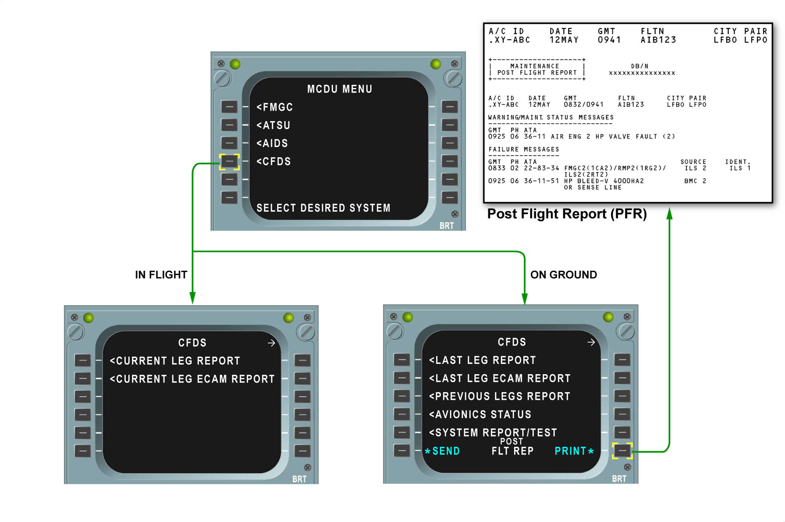
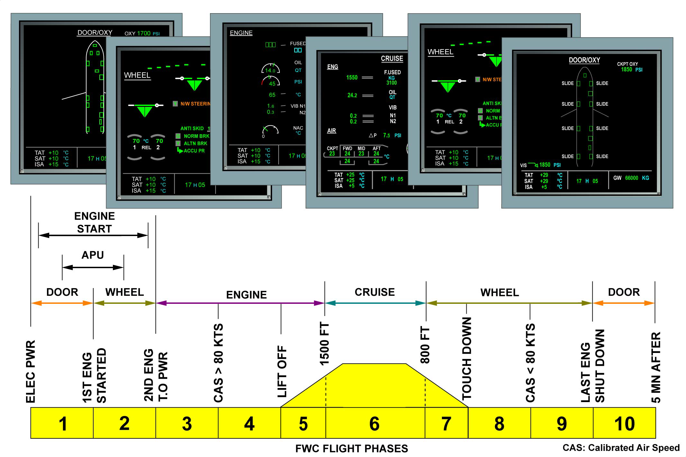
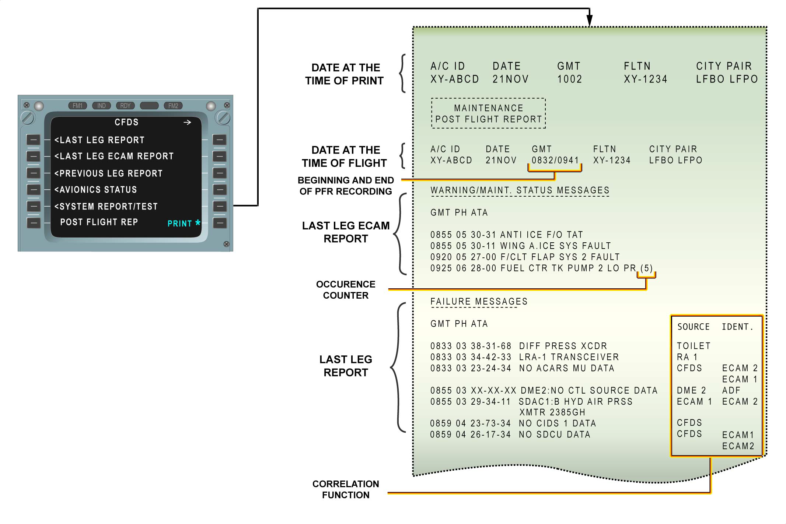

# Introduction

## A320 Family Aircrafts have No Fault Found Policy(NFF)

The aircraft is equipped with a high number of digital items of equipment . In most of the cases , computers may be recovered after a abnormal behaviour or a detected fault , either by a software reset(reset of the microprocessor) or by interrupting the power supply of its processing parts for a short time . This is achieved with the normal cockpit controls(engagement levers , pushbutton switches ), by selecting the related control off then on or by a action on the corresponding circuit breaker .

A320 Family maintenance concept is based on the use of the **Centralized Fault Display System (CFDS)** and the **Troubleshooting Manual (TSM)**

The Main purpose of the CFDS is to ease aircraft maintenance by compiling failure information from system BITE (Built in Test Equipment) and providing system BITE test capability from the cockpit

### Built-In Test Equipment

The CFDS also takes into account a major objective of the line maintenance which is to avoid unjustified removal of equipment .For these reasons the CFDS makes a detailed analysis to identify the responsible LRUs ; this is also to confirm that the event was actually due to a hardware failure and not a intermittent fault .To achieve its purpose ; the cfds has several major functions which supply a maintenance Post Flight Report (PFR) which is printed at the end of each flight .

### Failure Classification & Indication:-

The CFDIU generates its flight/ground condition using some parameters transmitted by the Flight Warning Computer
(FWC), the Flight Augmentation Computer (FAC), the memorised maintenance
phases and a discrete signal from the Landing Gear Control and Interface U
(LGCIU).
In normal operation, t phase information is transmitted by the FWCs to the
CFDIU and when a new flight number is entered the information is given by the
FAC.Failure Reporting per flight phase

### Failure Classification

The maintenance message classification is based on fault consequences on flight
operations:

- Class 1 faults may have an operational consequence on flight
- Class 2 faults have no immediate operational consequence on flight
- Class 3 faults have no consequence on flight.

#### Trouble Shooting of Faults Reported on the PFR

The following general procedure describes trouble shooting of Upper ECAM DU
warnings, ECAM STS (Status) Maintenance messages or CFDS fault messages given
on the PFR.

- Compare the ECAM warning or ECAM STS message with the CFDS fault message (if applicable) on the PFR to obtain the fault symptom and the ATA chapter reference. A time difference of 1-3 minutes between the fault message and the warning message may occur due to CFDIU internal behaviour.

- Use the Trouble Shooting function to retrieve the fault symptom, correlate the
  CFDS message and retrieve the associated fault isolation procedure.

- For further fault isolation use the source (SOURCE column) and/or CFDS fault
  message identifiers (IDENT block). Due to the number of possible identifier, the
  fault message identifier in the TSM must be the same as on the PFR.

- **ECAM display**:-Display :Maintenance Status are only displayed in flight phases 1
  and 10 (i.e. engine not running). It means that when one system sends a
  maintenance status to be displayed, the FWC will delay it until flight phase 10
  pending the system keeps on sending the fault. But the alert will be reported in
  the PFR at the time when the maintenance status has been computed for Maintenance action.
  

### BITE:-Troubleshooting via MCDU

**PFR**:- The POST FLIGHT REPORT, which is part of the main maintenance menu,
associates all the ECAM warnings (primary and independent) and the fault messages (class 1 and 2) of the last flight, given information concerning the failed
LRU if the faulty message is not sufficiently precise.

The correlation between the fault messages and the ECAM warnings is done by GMT time stamp comparison.This item is the “sum” of LAST LEG REPORT and LAST LEG ECAM REPORT items.

These messages are separated into two parts; the first part contains the ECAM
warnings associated with the time, the flight phase and the ATA reference, the
second contains the failed LRUs associated with the time, the ATA reference and
the identifiers. Aircraft identification, the date, the flight time, the flight number
(airline) and the departure and arrival airports are included in the header.

The following data are recorded in the PFR:

- ECAM WARNING MESSAGES:-The ECAM WARNING MESSAGES contains::- the
  warning message available on the upper ECAM display unit & the maintenance
  status These warning messages are associated with their ATA reference (aid for
  cross referencing with the maintenance message).FAULTS: Maintenance
  messages are listed in the PFR in the FAILURE MESSAGES part. Additional
  informatidn is associated with each message.

- FLIGHT PHASE — GMT Flight operational phases (CLIMB, CRUISE, etc.) are
  indicated in coded form in the PFR in front of the warning message. The time
  (GMT) is also given in front of the warning message and the maintenance
  message.
  
- **ATA:** This is the ATA chapter of the first suspected component. It is the entry
  Point to the technical documentation. It may also be an aid in relation to the
  Corresponding warning message and with the GMT.

### LAST/CURRENT LEG REPORT

- A CURRENT LEG REPORT is elaborated during the flight. After the flight, its title
  becomes LAST LEG REPORT. The purpose of this item is to present the failure messages ,concerning all systems ,occured during the Last/Current Flight . Each message contains
  the test of failure, the ATA reference and the flight phase and time at which the failure occurred. A function correlates the "SOURCE" failure
  message with the "resulting" failure messages.

  - **SOURCE:** Name of system affected by a failure.
  - **IDENTIFIER:** Name of system affected by an external failure, which is correlated with the SOURCE failure. The CFDIU Capacity for failure message memorization is upto 40 lines

* Class 1 Failure Messages associated with an ‘ECAM Warning’.

* Class 2 Failure Messages associated with a ‘maintenance status F/CTL’.

